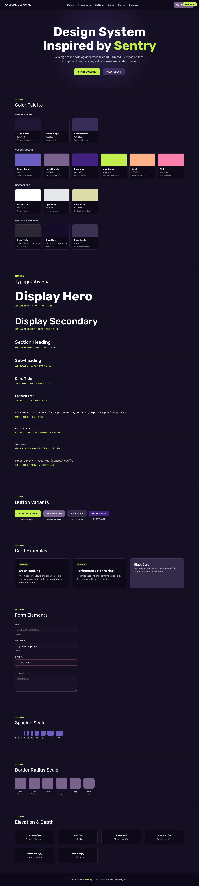
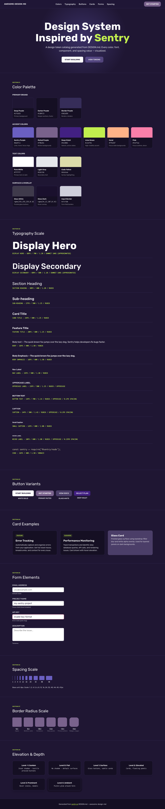

# Sentry Inspired Design System

[DESIGN.md](./DESIGN.md) extracted from the public [sentry](https://sentry.io/) website. This is not the official design system. Colors, fonts, and spacing may not be 100% accurate. But it's a good starting point for building something similar.

## Files

| File | Description |
|------|-------------|
| `DESIGN.md` | Complete design system documentation (9 sections) |
| `preview.html` | Interactive design token catalog (light) |
| `preview-dark.html` | Interactive design token catalog (dark) |

Use [DESIGN.md](./DESIGN.md) to use as a reference for AI agents (Claude, Cursor, Stitch) to generate UI that looks like the Sentry design language.

## Preview

A sample landing page built with DESIGN.md. It shows the actual colors, typography, buttons, cards, spacing, and elevation, all in one page.

### Dark Mode

### Light Mode

